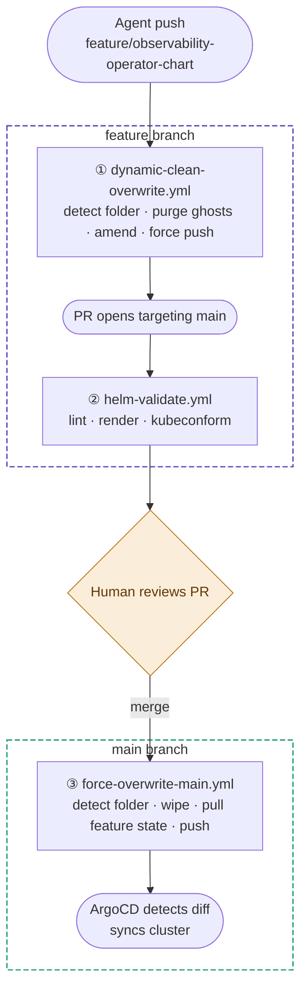

# GitOps Workflow Overview

Three workflows coordinate the agent → validation → cluster delivery pipeline.

---

## Flow

---

## Workflows

### ① `dynamic-clean-overwrite.yml`
**Trigger:** push to `feature/observability-operator-chart` (ignores `.github/**` changes)

Diffs `HEAD` against `HEAD~1` to detect which top-level folder the agent modified. Backs it up, strips it entirely from Git's index (eliminating ghost files from previous runs), restores the agent's new files, then amends the commit and force-pushes — keeping history linear.

### ② `helm-validate.yml`
**Trigger:** PR targeting `main` touching any `observability_operator_chart*/**` path

Uses `find` to dynamically locate the chart folder, then runs the full validation chain: `helm dependency update` → `helm lint` → `helm template` → `kubeconform --strict`. This is the gate the human sees before deciding to merge.

### ③ `force-overwrite-main.yml`
**Trigger:** push to `main` touching any `observability_operator_chart*/**` path

Mirrors workflow ①'s `git diff-tree` detection to find which folder landed on main. Wipes it from the index, fetches the exact state from `origin/feature/observability-operator-chart`, and commits cleanly to main. ArgoCD picks up the diff from there.

---

## Key design decisions

| Decision | Reason |
|---|---|
| `fetch-depth: 2` on all three workflows | Only `HEAD` and `HEAD~1` are needed to diff the commit; full history is unnecessary overhead |
| `paths-ignore: .github/**` on workflow ① | Prevents the workflow from triggering on its own file changes |
| `if: github.actor != 'github-actions[bot]'` | Stops workflows from re-triggering each other in a loop |
| Folder detection via `git diff-tree` | Fully dynamic — no folder name is hardcoded, works for any chart deployment target |
| `feature/observability-operator-chart` hardcoded as source in workflow ③ | The agent always writes to one branch; the source is fixed by design even if the folder name varies |
